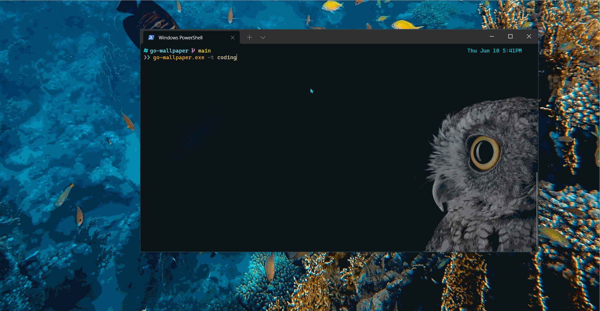

# go-wallpaper

go-wallpaper is cli tool for setting random wallpapers for windows. It is built with Golang and inspired by [styli.sh](https://github.com/thevinter/styli.sh)

## how it works

## features

- currently it downloads images from [Unsplash](https://unsplash.com)
- it can take resolution as a flag
- it can take a search term/tag a parameter
- `go-wallpaper.exe --help` for help

## how to use

- If you already have go installed in your system, you can clone this repo and run the following commands
  - `go mod tidy` to install dependencies
  - `go install` to add the binary to your gopath
- You can download the pre-built binaries from releases sections and add it to your path to use it

## features to come

- [ ] Set wallpapers from subreddits like `r/wallpapers` etc...
- [ ] Flag for saving the wallpaper permanently
- [ ] Writing tests and maybe publish it as package for others to use

## contribution

the project is a mess currently 😓, I will clean it, and add make it easy for contribution, so until then I can not accept any contributions
