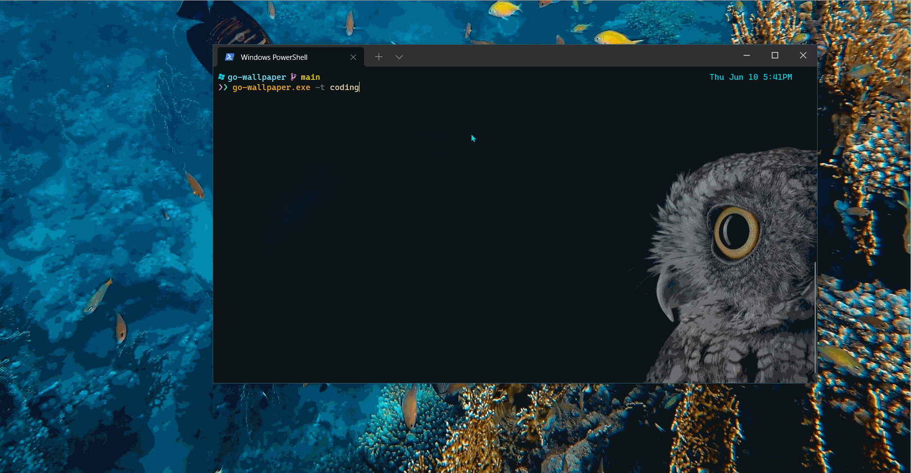

# go-wallpaper

go-wallpaper is a cli tool for setting random wallpapers for Windows.
It is built with Golang and inspired by [styli.sh](https://github.com/thevinter/styli.sh)

## How it works



## Features

- It can set wallpapers from [Unsplash](https://unsplash.com), subreddits like `/r/wallpaper`, `/r/wallpapers`
- `go-wallpaper.exe help` for help

## How to install

- If you already have Golang installed, you can clone this repo and run the following commands
  - `go mod tidy` to install dependencies
  - `go install` to add the binary to your gopath
  - make sure the `bin` directory of your gopath is in your `system path`
- Or you can download the pre-built binaries from releases sections and add it to your path (or somewhere you can use it from terminal, cmd, powershell etc...)

## How to use

```bash
# set a random background from unsplash
# the default resolution is 1920x1080
> go-wallpaper.exe

# provide resolution with -r or --resolution flag
> go-wallpaper.exe -r 2560x1440

# random background from unsplash with a search term/tag
# -t <tag> or --tag <tag>, multiple tags should be separated
> go-wallpaper.exe -t sunset
> go-wallpaper.exe -t "sunset,beach"

# set a random background from one of these subreddits "EarthPorn", "wallpaper", "wallpapers", "multiwall"
# resolution, tag flags won't have any effect here
> go-wallpaper.exe reddit
```

## Features to come

- [x] Set wallpapers from subreddits like `r/wallpapers` etc...
- [ ] Set wallpapers from NASA image library [NASA Images](https://images.nasa.gov/), [NASA API Docs](https://images.nasa.gov/docs/images.nasa.gov_api_docs.pdf)
- [ ] Wallpapers from different sections of subreddit like `hot`, `new`, `top` etc...
- [ ] Flags for custom subreddit
- [ ] Flags for selecting wallpapers from a specific unsplash collection
- [ ] Flags for saving the wallpapers permanently with a different name
- [ ] Writing tests and maybe publish it as package for others to use

## Contribution

the project is a mess currently 😓, I will clean it, and make it easy for contribution, so until then I can not accept any contributions
